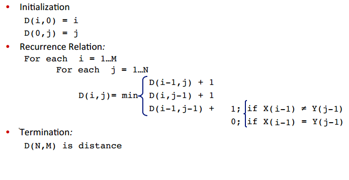

# 最短编辑距离

## 1.编辑距离
* 从字符串word1到word2的操作有3种
    - 增加一个字符
    - 删除一个字符
    - 删除一个字符

* 编辑距离： 从字符串word1到word2所需要的最少操作步骤


## 2.怎么找到最短的编辑距离

* 对于字符串X,Y
    - X的长度为m
    - Y的长度为n
* 我们定义一个D(i,j)，表示X[1,i]和Y[1,j]的编辑距离
    - 则最短编辑距离为D(m,n)


* if i == 0 && j == 0,即''和''最短距离肯定为0
* if i == 0 && j > 0,即''和'word2'的最短距离肯定为j
* 同理 i > 0,j == 0的话，D(i,j)为i
* 所以这里将dp初始化
```js
    for(var i = 0;i <=len1;i++){
        dp[i][0] = i
    }

    for(var i = 0;i<=len2;i++){
        dp[0][i] = i
    }
```

## 3.动态规划求解


* 动态规划的核心就是求解这个状态时，是根据上个状态确定的
* 求解dp[i][j]时，有三种情况如上图所示
    - 插入 insertion
        + 即'abc'和'xyzd'最后一个字符是插入编辑
        + 此时最短距离应为dp[i][j-1] + 1
        + 即'abc'和'xyz'的最短距离加上1
    - 删除 deletion
        + 和插入一样
        + 比如 'xyad'和'abc'最后一个字符则是删除编辑
        + 最短距离为dp[i-1][j] + 1
    - 替换 replace
        + 分为两种情况
        + word1[i-1]与 word2[j-1]相等
            * **注意，word1和word2的[i-1]表示的是第i个字符**
            * **而dp[i][j]因为加了一层[0][0]所以表示的是word1[0到i-1]和wod[0到j-1]的最短编辑距离**
            * 相等的话这两个字符不用操作,肯定等于dp[i-1][j-1]
            * 比如'abc'和'xyc' 最后一个字符最短距离就为'ab''xy'的最短距离
        + word1[i-1]与 word2[j-1]不等
            * 不相等的话需要替换一次
            * dp[i-1][j-1]+1
            * 比如'abc'和'xyz'最后一个字符的最短距离为'ab''xy'的最短距离加一

### 得到代码如下：

```js
for(var i =1;i<=len1;i++){
    for(var j=1;j<=len2;j++){
        var insertion = dp[i][j-1] + 1
        var deletion = dp[i-1][j] + 1
        var replace = dp[i-1][j-1] + (word1[i-1] == word2[j-1] ? 0 : 1)
        dp[i][j] = Math.min(insertion,deletion,replace)
    }
}
```

这个算法的时间复杂度为O(mn)空间复杂度为 O(mn)
